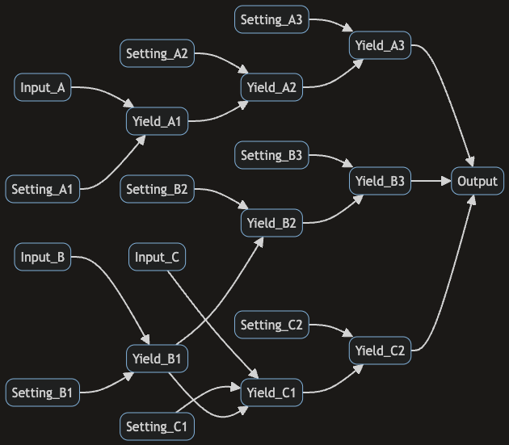

# Optimising Yield in Production Lines with CausaDB

<!-- Github badge linking to ipynb -->
[](https://github.com/causalabs/causadb-examples/blob/main/python/production_line/main.ipynb)

Manufacturing production and assembly lines are how most modern products are made, from silicon computer chips to vaccines. They are inherently complex systems with a large number of moving parts and interdependencies. The complex nature of production lines and their interconnected nature makes it difficult to adjust and optimise their performance without a deep understanding of how they work. Traditional methods of optimising production lines are often based on trial and error or bespoke digital twins, both of which are time-consuming and expensive in their own ways.

Standard AI and ML techniques are not well-suited to this task because they do not capture the causal relationships between variables in the system. This makes many AI-driven approaches to optimising production lines ineffective at best and even harmful at worst. Fortunately, causal ML models *can* build a deep understanding of complex systems with relatively minimal data. This makes causal ML extremely well-suited to the problem of optimising production lines to maximise yield, reduce energy wastage, and minimise byproducts. 

In this technical example, we will show how to use CausaDB to build a causal model of a production line and use it to optimise yield. We'll be using simulated data for this example, but the same principles apply to real-world data. Our simulations are based on a production line like the one shown below:


Here there are three inputs, leading to different areas of the production line, each with their own set of machines and processes. The machines and processes are controlled by a set of configuration settings, and the output of the production line is the final product. There may also be byproducts or waste that are produced as part of the process.

## Setup

We won't go into the details of setting up CausaDB in this example. If you haven't already set up CausaDB, you can follow the instructions in the [Quickstart Guide](../causadb_quickstart). You can visit the [Github repository](https://github.com/causalabs/causadb-examples/blob/main/python/production_line/main.ipynb) for this example to see the full code.

## Data

We'll be using a simulated dataset for this example. The dataset contains the following columns:

* `Input_A`, `Input_B`, `Input_C`: The input materials for the production line, this could be raw stock, chemicals, or components coming into the production line from another source.
* `Setting_*`: Configuration settings for the production line, these could be things like temperature, pressure, or speed settings for each machine at different points along the production line.
* `Yield_*`: The yield of the production line at different points, this could be the proportion of good products to bad products, or the proportion of raw materials that are converted into useful products at each stage of the production line
* `Output`: The final output of the production line, again, this could be the proportion of good products to bad products, or the proportion of raw materials that are converted into useful products at the end of the production line.

```python
data = pd.read_csv('production_data.csv')
data.head()
```

|    |   Input_A |   Input_B |   Input_C |   Setting_A1 |   Setting_B1 |   Setting_B2 |   Setting_C1 |   Setting_C2 |   Yield_A1 | Setting_A2 |Yield_B1 |   Setting_B3 |   Yield_A2 |   Setting_A3 |   Yield_B2 |   Yield_C1 |   Yield_A3 |   Yield_B3 |   Yield_C2 |   Output |
|---:|----------:|----------:|----------:|------------:|------------:|------------:|------------:|------------:|-----------:|------------:|-----------:|------------:|-----------:|------------:|-----------:|-----------:|-----------:|-----------:|-----------:|---------:|
|  0 |     62.21 |     91.48 |     72.55 |        0.34 |        0.42 |        0.39 |        0.52 |        0.87 |       0.64 |        0.54 |       0.52 |        0.51 |       0.62 |        0.62 |       0.53 |       0.38 |       0.6  |       0.63 |       0.68 |     0.88 |
|  1 |     74    |    124.91 |     75.04 |        0.65 |        0.34 |        0.35 |        0.27 |        0.63 |       0.54 |        0.74 |       0.47 |        0.54 |       0.73 |        0.69 |       0.45 |       0.2  |       0.75 |       0.57 |       0.41 |     0.85 |
|  2 |    121.3  |    121.1  |     87.57 |        0.51 |        0.59 |        0.62 |        0.32 |        0.44 |       0.69 |        0.49 |       0.6  |        0.64 |       0.59 |        0.69 |       0.77 |       0.38 |       0.65 |       0.78 |       0.35 |     0.85 |
|  3 |    116.46 |    115.3  |     94.24 |        0.84 |        0.36 |        0.7  |        0.36 |        0.66 |       0.56 |        0.76 |       0.5  |        0.85 |       0.7  |        0.77 |       0.68 |       0.35 |       0.8  |       0.88 |       0.46 |     0.95 |
|  4 |     67.43 |    145.29 |     94.29 |        0.68 |        0.39 |        0.59 |        0.49 |        0.7  |       0.44 |        0.81 |       0.53 |        0.67 |       0.65 |        0.94 |       0.63 |       0.49 |       0.82 |       0.84 |       0.66 |     0.99 |

## Building a Causal Model

The complexity of production lines means that the causal graphs can be quite large, with many nodes and edges. Fortunately they can often be automatically extracted from schematics like the one above programmatically. We've already done this and stored the nodes and edges as JSON files, so we can load them directly from file.

```python
with open('nodes.json', 'r') as f:
    nodes = json.load(f)

with open('edges.json', 'r') as f:
    edges = json.load(f)

model = client.create_model("example-production-model")
model.set_nodes(nodes)
model.set_edges(edges)

model.train("example-production-data")
```

## Visualising the Model

Using the built-in plotting tools in CausaDB, we can visualise the causal graph of the production line. This can be useful for manual checking and debugging. Here we'll set the style to flowchart, as this style is particularly useful for visualising production lines and other systems with a linear flow.

```python
plot_causal_graph(model, style="flowchart", theme="dark", direction="LR")
```



Here we can see the causal relationships between different variables in the production line. The `Setting_*` nodes are the configuration settings for the machines and processes in the production line. These settings are modifiable and can be used to optimise the production line for maximum yield.

## Find optimal machine configurations to maximise yield

To find the best set of configuration settings to set, we can use the `find_best_actions` function to find the combination of configuration settings that will maximise yield. In this case our goal will be solely to maximise the output yield, but in real-world scenarios you may want to balance multiple objectives, such as minimising energy usage or waste production while maximising yield.

```python
optimal_config = model.find_best_actions(
    targets={"Output": "maximise"},
    actionable=["Setting_A1", "Setting_A2", "Setting_A3", "Setting_B1", "Setting_B2", "Setting_B3", "Setting_C1", "Setting_C2"],
)

optimal_config.round(2)
```

This set of configuration settings can then be applied to the machines in the production line to maximise yield. More precise control for specific scenarios could be achieved by also setting some of the variable inputs to the process using `fixed` in the `find_best_actions` function. But in this example we are optimising across a range of input scenarios that match the data we have.

If running `find_best_actions` in multi-target mode, the multiple targets can be weighted to reflect the relative importance of each objective using the `target_importance` parameter. We'll show an example of using this feature in practice in a future example.

:::note
We could go even further here. In this example `find_best_actions` is being used to find the best configuration settings for the production line over multiple scenarios (usually by day or shift). However, we could also use it to find the best configuration settings for a specific scenario, by setting the `fixed` parameter to the specific input values for that scenario. This would allow us to optimise the production line for a specific set of input values, rather than across a range of values, giving much more precise control and even greater improvements. However this also requires being able to set the machine settings in real-time, which may not be possible in all cases. If it is possible, then this can be a very powerful tool for improving yield and reducing waste.
:::

## Explain the causes of yield

Unlike standard AI/ML models that only understand correlations, causal models can explain the true causes of an outcome. We can use the `causal_attributions` function to find the causes of yield `Output` and their relative magnitudes.

```python
plot_causal_attributions(model, "Output")
```


Unlike standard AI models, causal attribution plots show the causal effect of making a tweak to one of the input factors. This is important in systems such as production lines where there are long chains of causality as machines feed their outputs into each other sequentially. Standard AI models usually attribute most cause to the factors nearest to the outcome node because that is where the signal is strongest. Causal models are the only way to accurately attribute causality and make correct optimisation decisions. This is import both for explainability and for making sure that the optimisation decisions are actually correct.

## Comparison with non-causal models

To show why it's vital to use causal models for this kind of problem, we'll compare the results of the causal model with a neural network model, but the same principles apply to all non-causal models, LLMs included. We won't go into the details of training the neural network model here, but you can see the full code in the Github repository. The model is trained on the same data as the causal model, and then an optimisation is to run to find the best configuration settings to maximise yield on the production line. You can see the results below:


The causal model achieves a higher yield of about 13% than the baseline, whereas the neural network model actually performs worse than the baseline, despite a strong performance on the test set. This is because the neural network model is unable to capture the causal relationships between the variables in the system, and so is unable to make accurate predictions about the effects of changing the configuration settings. This is a problem that would usually only be discovered after the model has been deployed and is making decisions in the real world, which could be extremely costly and even dangerous.

## Summary

In this example, we've shown how CausaDB can be used to optimise yield on a production line. By modelling the causal relationships between machines and their settings, we can create a kind of causal twin of the real world system. This can be used to find the optimal configuration settings required to maximise yield. We can also use the causal model to explain the causes of yield and their relative magnitudes.

If you're interested in learning more about how CausaDB can be used to optimise production lines or complex systems, please get in touch with us at [causadb@causa.tech](mailto:causadb@causa.tech).