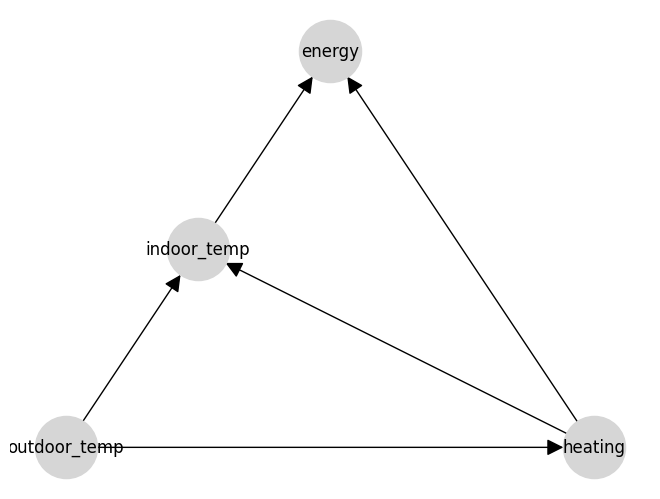

# Model Structure

Check out the video below for a quick overview of defining causal graphs.

    <iframe src="https://www.youtube.com/embed/VLLKnVWDpQo?si=1S8zR6YxlH1oiLhW" frameborder="0" allow="accelerometer; autoplay; clipboard-write; encrypted-media; gyroscope; picture-in-picture; web-share" allowFullScreen style={{position: 'absolute', top: 0, left: 0, width: '100%', height: '100%'}}></iframe>

Causal AI models are built around causal graphs, which represent the potential relationships between variables in a system. In causal graphs, nodes represent variables, and edges represent potential causal relationships between variables. These relationships are directed, meaning that the arrow points from the cause to the effect. A simple causal graph might look something like this:

<!-- Image of a causal graph -->

One key property of causal graphs is that they are acyclic, meaning that there are no loops in the graph. This is because a causal relationship between two variables implies a temporal ordering, where the cause must precede the effect, so a loop would imply causality acting backwards in time. If you feel that you need a loop in your graph, then you have a time series, and should see the relevant section below more information on how to handle time series data.

The strongest assumptions when building a causal graph are the missing edges. These are the edges that are not present in the graph, and represent the assumption that there is no direct causal relationship between the variables. This means that the AI model won't attempt to learn a relationship between these variables.

If you add an edge then you're enabling the AI to learn a relationship betweeen those variables. Causal AI removes the limitations of standard AI. Standard AI assumes a causal graph where all the variables cause the outcome only. In causal AI we relax this assumption and allow the AI learn how other variables to cause each other too. An arrow does not mean that you are forcing there to be a causal effect, it means that you are allowing the model to learn the extent (if any) of the causal effect between the variables. This means that the AI is able to learn a world representation that works when it's deployed in the real world.

## Defining a Causal Graph

When building a causal AI model, the first step is to define the nodes and edges of the causal graph. This can be done manually by specifying the nodes and edges in code, or by using a graphical interface to build the graph visually. Our model builder tool allows you to drag and drop nodes and edges (arrows) to define the structure of your model, and then export the model to code for training and querying: [CausaDB Model Builder](https://builder.causadb.com).\

Check out the video below for a quick overview of defining causal graphs.

    <iframe src="https://www.youtube.com/watch?v=Ik_e52Sq51w" frameborder="0" allow="accelerometer; autoplay; clipboard-write; encrypted-media; gyroscope; picture-in-picture; web-share" allowFullScreen style={{position: 'absolute', top: 0, left: 0, width: '100%', height: '100%'}}></iframe>

## Learning a Causal Graph from Data

An alternative to manually defining the causal graph is to learn the structure of the graph from data. This can be done using causal discovery algorithms, which infer the causal relationships between variables from observational data. These algorithms can be limited by the assumptions they make about the data, and may not always be able to accurately infer the true causal relationships. However, they can often be a useful tool for exploring the causal relationships in your data and generating hypotheses for further investigation.

:::note

We have some exciting updates coming soon to CausaDB that will make it easier to learn causal graphs from data, in a way that improves on current methods. Stay tuned for more information!

:::

## Feedback Loops in Time Series

Time series data are a common use case for causal AI models, as many real-world systems are dynamic and evolve over time. But as mentioned earlier, feedback loops in causal graphs are not allowed. When working with time series data, this problem is solved by assigning variables to different time points. For example a variable `x` at time `t` can be represented as `x_t`, and the causal relationship between `x_t` and `x_{t-1}` can be represented as an edge in the causal graph. This allows the model to capture the temporal relationships between variables without introducing loops in the graph.

:::note

We're currently working on adding explicit support for time series data in CausaDB, including built-in functions for handling time series data and temporal relationships in the causal graph. Stay tuned for updates on this feature!

:::